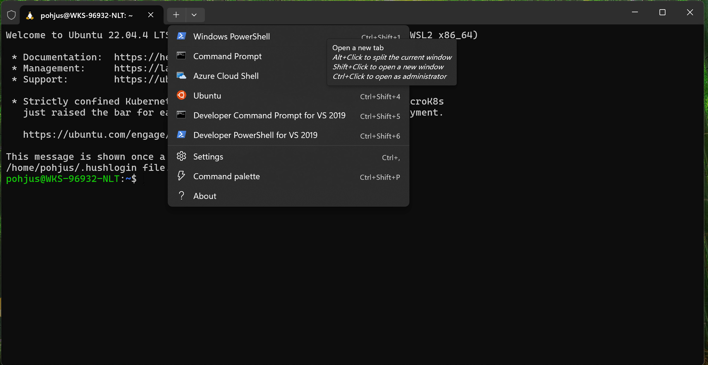
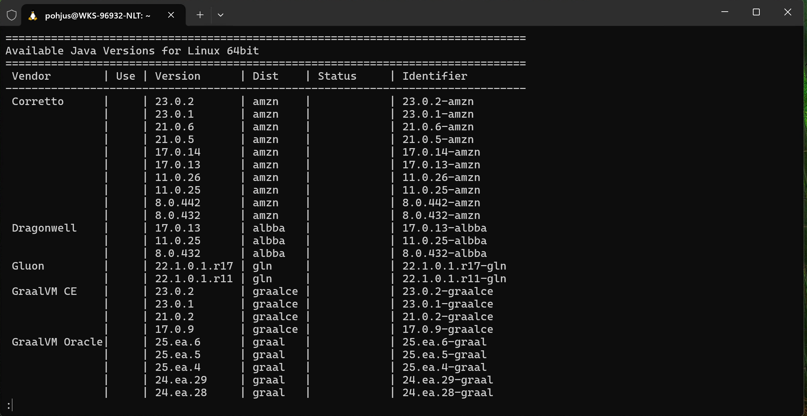
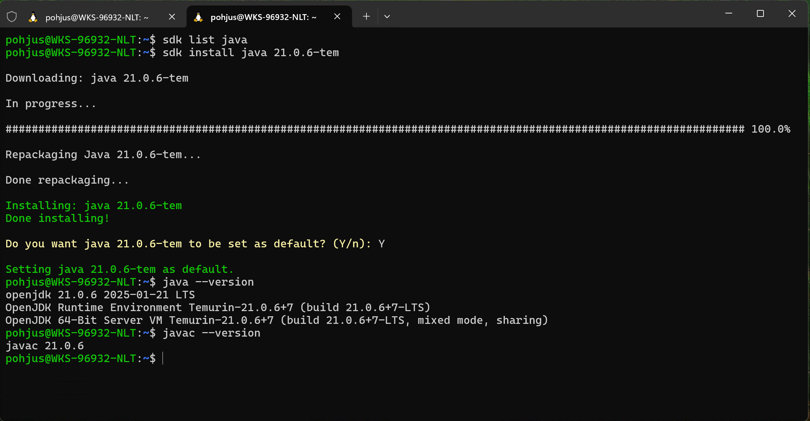
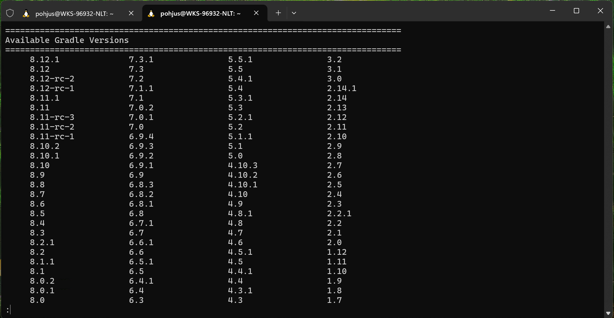

# ☕ Java Development Tools Installation Guide

Welcome to the **Java Development Tools Installation Guide**! 🚀 This guide will help you install essential tools for Java development, including Java, Kotlin, Gradle, and Maven.

---

## ✅ Required Tools

You'll need the following tools installed:

- [Java (LTS version)](https://adoptium.net/en-GB/)
- [Kotlin](https://kotlinlang.org/docs/command-line.html)
- [Gradle](https://gradle.org/install/)
- [Maven](https://maven.apache.org/download.cgi)

The **recommended** way to install all these tools is via **[SDKMAN!](https://sdkman.io)**, which works best on **Unix-based systems (macOS & Linux).** 🐧🍏
SDKMAN allows easy installation, configuration, and management of multiple versions of these tools via the command line.

For **Windows**, here are some of the options:

- [Cygwin](https://www.cygwin.com)
- **Windows Subsystem for Linux (WSL)**
  – Install instructions below ⬇️

💡 _Note:_ GUI-based applications can be challenging in WSL2. 😞

---

## 🍏 Installing SDKMAN on macOS

Open **Terminal** and run:

```bash
curl -s "https://get.sdkman.io" | bash
```

Restart your terminal, then install:

```bash
sdk list java
sdk install java xx.y.z-tem   # install LTS version from Temurin
```

Example:


And other tools if needed:

```bash
sdk install kotlin
sdk install gradle
sdk install maven
```

---

## 🖥️ Installing Java Development Tools on Windows (WSL2)

You can install [Windows Subsystem for Linux](https://www.windowscentral.com/install-windows-subsystem-linux-windows-10)
and [Ubuntu from the Store](https://www.microsoft.com/en-us/p/ubuntu-2004/9n6svws3rx71?activetab=pivot:overviewtab).
You can also install [Windows Terminal](https://www.microsoft.com/en-us/p/windows-terminal/9n0dx20hk701?activetab=pivot:overviewtab).

Then open the new terminal and launch Ubuntu:



Install zip and unzip utilities:

```bash
sudo apt-get install unzip zip
```

Then install sdkman by running:

```bash
curl -s "https://get.sdkman.io" | bash
```

Reboot your terminal (close and reopen Ubuntu).

---

## 🎯 Manual Installation (Without SDKMAN)

If you prefer **manual installation**, use the links below:

- [Download Java (LTS)](https://adoptium.net/en-GB/)
- [Download Kotlin](https://kotlinlang.org/docs/command-line.html)
- [Download Gradle](https://gradle.org/install/)
- [Download Maven](https://maven.apache.org/download.cgi)

After downloading, ensure they are added to your system **PATH** for easy access. ✅

---

## 🚀 Verifying Installations

Check if the installations were successful by running these commands:

```bash
java -version
kotlin -version
gradle -version
mvn -version
```

# Installing Java Tools for Backend Development

## Tools

Common tools for Java Backend Development are:

- [Java (LTS version)](https://adoptium.net/en-GB/) or [Kotlin](https://kotlinlang.org/docs/command-line.html)
- [Gradle](https://gradle.org/install/) or [Maven](https://maven.apache.org/download.cgi)
- [Spring Boot CLI](https://docs.spring.io/spring-boot/cli/index.html) (optional)
- [Docker](https://www.docker.com) (optional)
- [Intellij IDEA Ultimate](https://www.jetbrains.com/community/education/#students) or some other IDE

The **recommended** way to install most of these tools is via **[SDKMAN!](https://sdkman.io)**, which works best on **Unix-based systems (🍏 macOS and 🐧 Linux).** SDKMAN! allows easy installation, configuration, and management of multiple versions of these tools via the command line.

For **Windows**, here are some of the options:

- [Cygwin](https://www.cygwin.com)
- **Windows Subsystem for Linux (WSL2)** - Install instructions below.

💡 _Note:_ GUI-based applications can be challenging in WSL2. 😞

## macOS Installation for SDKMAN!

Open the terminal and give the command:

```bash
curl -s "https://get.sdkman.io" | bash
```

Reboot your terminal.

See the commands on how to install below, they should be almost the same than in WSL2 ⬇️

## Windows: Subsystem for Linux and SDKMan!

You can install [Windows Subsystem for Linux](https://www.windowscentral.com/install-windows-subsystem-linux-windows-10)
and [Ubuntu from the Store](https://www.microsoft.com/en-us/p/ubuntu-2004/9n6svws3rx71?activetab=pivot:overviewtab).
You can also install [Windows Terminal](https://www.microsoft.com/en-us/p/windows-terminal/9n0dx20hk701?activetab=pivot:overviewtab).

Then open the new terminal and launch Ubuntu:


Install zip and unzip utilities:

```bash
sudo apt-get install unzip zip
```

Then install sdkman by running:

```bash
curl -s "https://get.sdkman.io" | bash
```

Reboot your terminal (close and reopen Ubuntu).

## Java Installation

Check available Java versions:

```bash
sdk list java
```

It should display:



Install the latest LTS version of Java Temurin, for example 21 or 25, you could use something like this:

```bash
sdk install java 21-0-6-tem
```

Or find dynamically using bash magic:

```bash
sdk install java $(sdk list java | grep -oP '21\.\d+\.\d+-tem' | head -1)
```

Set it as default.



Verify Java installation:

```bash
java -version
javac -version
```

If the command does not work, restart the terminal.

## Gradle Installation

Check available Gradle versions:



Install the latest version of Gradle:

```bash
sdk install gradle
```

## Maven Installation

If using older Maven tool, then:

```bash
sdk install maven
```

## Spring CLI

Spring Boot CLI is useful for quickly testing Spring Boot applications. You can install it using SDKMan!:

```bash
sdk install springboot
```

After installation, verify it works by running:

```bash
spring --version
```

## Docker in WSL2

To install Docker in WSL2, follow these steps:

1. **Enable WSL2 Backend for Docker Desktop:**

   - Download and install [Docker Desktop](https://www.docker.com/products/docker-desktop).
   - During installation, ensure **"Use the WSL2 based engine"** is enabled.
   - After installation, go to Docker Desktop settings and set **WSL integration** to **enabled**.

2. **Check WSL Integration:**
   Open **PowerShell** and run:

   ```powershell
   wsl --list --verbose
   ```

   Ensure your distribution is running under **WSL version 2**.

3. **Test Docker in WSL2:**
   Open **WSL2 (Ubuntu or other Linux distro)** and run:

   ```bash
   docker --version
   ```

   Then verify Docker is working:

   ```bash
   docker run hello-world
   ```

Now, Docker should be working inside WSL2! 🎉

Each command should return a version number. 🎉
