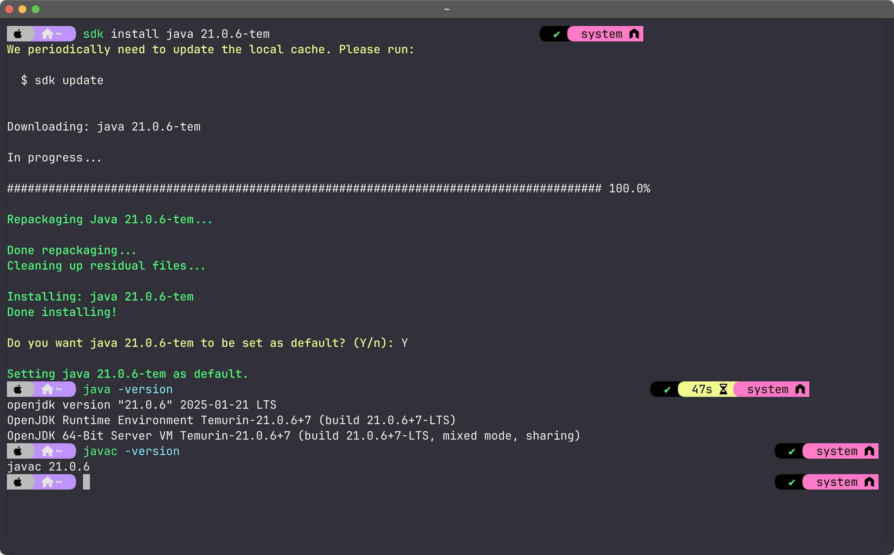

# ☕ Java Development Tools Installation Guide

Welcome to the **Java Development Tools Installation Guide**! 🚀 This guide will help you install essential tools for Java development, including Java, Kotlin, Gradle, and Maven.

---

## ✅ Required Tools

You'll need the following tools installed:

- [Java (LTS version)](https://adoptium.net/en-GB/)
- [Kotlin](https://kotlinlang.org/docs/command-line.html)
- [Gradle](https://gradle.org/install/)
- [Maven](https://maven.apache.org/download.cgi)

The **recommended** way to install all these tools is via **[SDKMAN!](https://sdkman.io)**, which works best on **Unix-based systems (macOS & Linux).** 🐧🍏
SDKMAN allows easy installation, configuration, and management of multiple versions of these tools via the command line.

For **Windows**, here are some of the options:

- [Cygwin](https://www.cygwin.com)
- **Windows Subsystem for Linux (WSL)**
  – Install instructions below ⬇️

💡 _Note:_ GUI-based applications can be challenging in WSL2. 😞

---

## 🍏 Installing SDKMAN on macOS

Open **Terminal** and run:

```bash
curl -s "https://get.sdkman.io" | bash
```

Restart your terminal, then install:

```bash
sdk list java
sdk install java xx.y.z-tem   # install LTS version from Temurin
```

Example:



And other tools if needed:

```bash
sdk install kotlin
sdk install gradle
sdk install maven
```

---

## 🖥️ Installing Java Development Tools on Windows (WSL2)

### 1️⃣ **Enable WSL**

Run this command in **PowerShell (Admin)**:

```powershell
wsl --install
```

If you already have WSL installed, update it:

```powershell
wsl --update
```

Restart your system and set **Ubuntu** as the default WSL distribution.

### 2️⃣ **Install SDKMAN in WSL**

Once WSL is running, open your Linux terminal and run:

```bash
curl -s "https://get.sdkman.io" | bash
```

Restart your terminal, then install Java, Kotlin, Gradle, and Maven as shown in the macOS section.

---

## 🎯 Manual Installation (Without SDKMAN)

If you prefer **manual installation**, use the links below:

- [Download Java (LTS)](https://adoptium.net/en-GB/)
- [Download Kotlin](https://kotlinlang.org/docs/command-line.html)
- [Download Gradle](https://gradle.org/install/)
- [Download Maven](https://maven.apache.org/download.cgi)

After downloading, ensure they are added to your system **PATH** for easy access. ✅

---

## 🚀 Verifying Installations

Check if the installations were successful by running these commands:

```bash
java -version
kotlin -version
gradle -version
mvn -version
```

Each command should return a version number. 🎉
