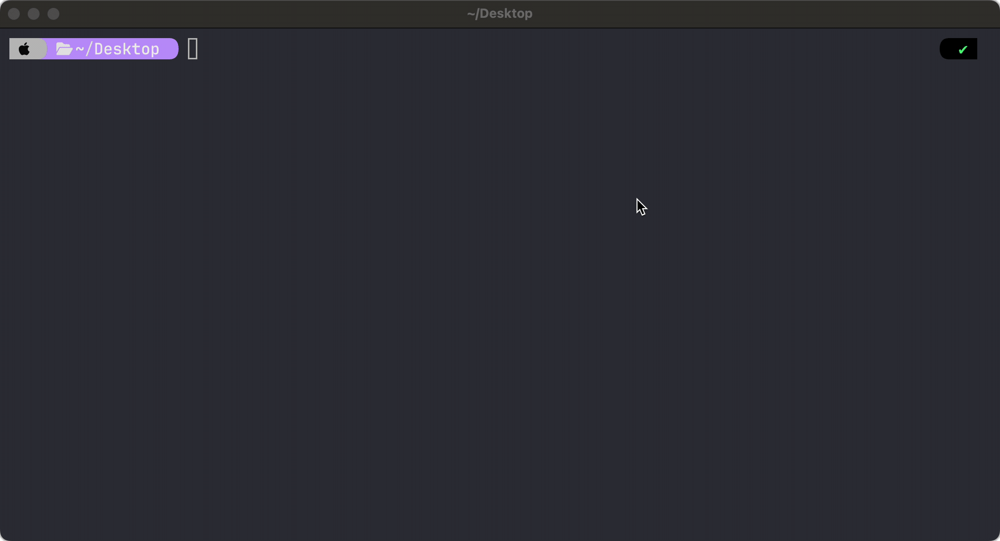
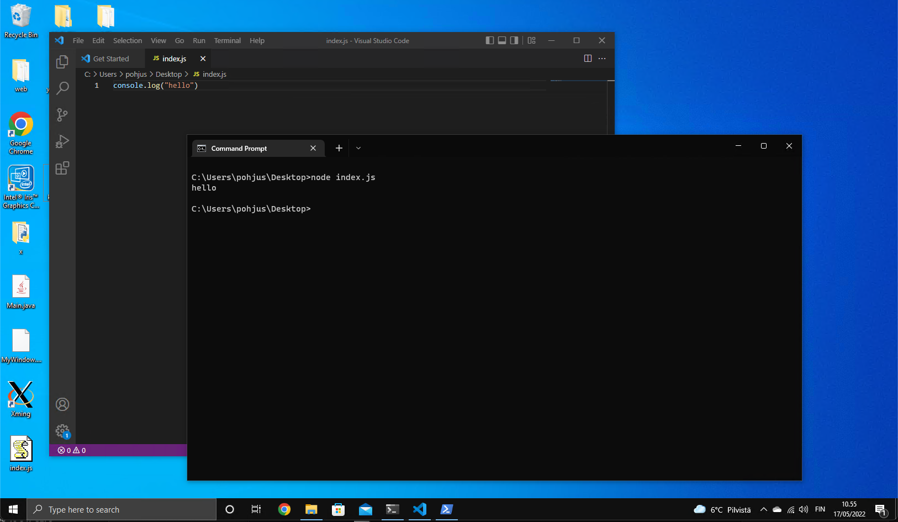
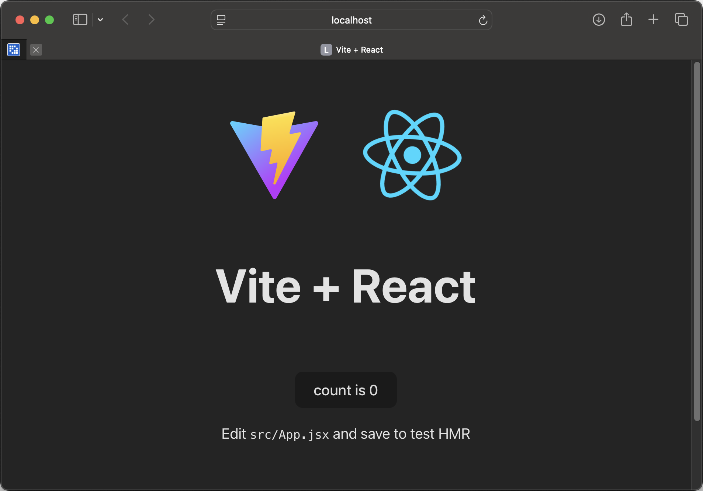
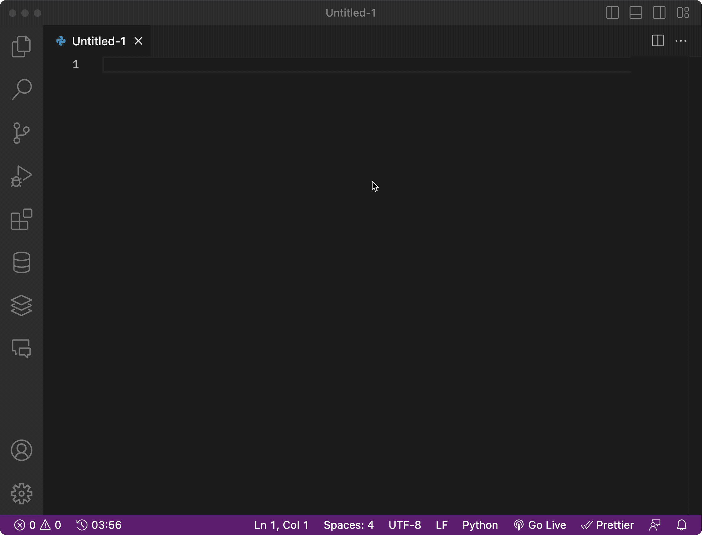
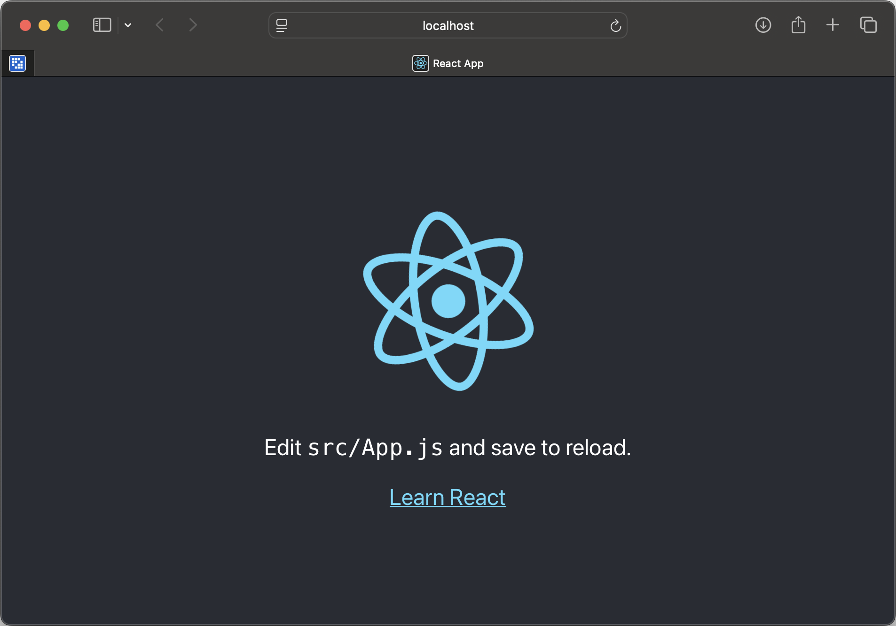
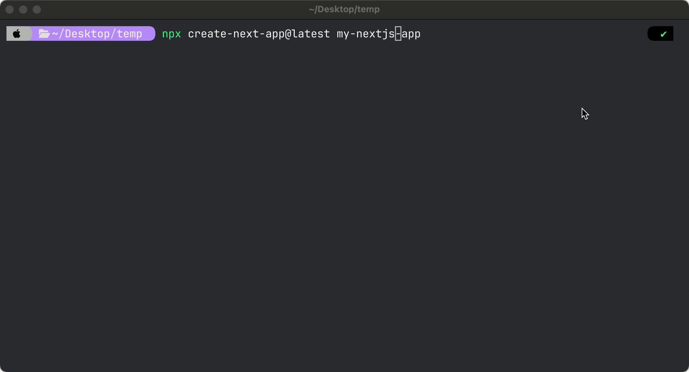

# ⚛️ React Development Tools Installation Guide

Welcome to the **React Development Tools Installation Guide**! 🚀 This guide will help you install and verify essential tools for React development, including **VS Code, Node.js, and Vite**.

---

## ✅ Quick Start

You'll need the following tools installed:

- [VS Code](https://code.visualstudio.com) - Code editor with great React support
- [Node.js (LTS Version)](https://nodejs.org/en) - JavaScript runtime for running React apps
- [Vite](https://vitejs.dev/) - Fast, modern build tool for React apps

Ensure you install the **LTS (Long-Term Support) version** of Node.js for stability.

Test that Node, Vite and VS Code works, see below!

---

## ⚠️ Test Node.js Installation

Create a text file called **`index.js`** with the following content:

```javascript
console.log("Hello, World!");
```

Run the script using Node.js:

```bash
node index.js
```

You should see this output:

```
Hello, World!
```

**Example in macOS Terminal:**



**Example in Windows (VS Code & Command Prompt):**



---

## ⚠️ Test Vite Installation

To create a new React app with Vite:

```bash
npm create vite@latest vite-app
```

Choose React, JavaScript + SWC:


Then:

```bash
cd vite-app
npm install
npm run dev
```

This will start a local development server. Open your browser and visit:

```
http://localhost:5173/
```



## ⚠️ Test VS Code

Test that you are able to install VS Code extensions:

- [ESLint](https://marketplace.visualstudio.com/items?itemName=dbaeumer.vscode-eslint)
- [Prettier](https://marketplace.visualstudio.com/items?itemName=esbenp.prettier-vscode)



---

### ❌ Depricated: CRA

React apps have been implemented using `create-react-app` tool. **As of 2025, create-react-app (CRA) is largely deprecated** and no longer the recommended tool for new React projects. The React ecosystem has evolved significantly, and there are now more modern, efficient, and actively maintained alternatives.

But most of "legacy" React projects are built using this tool.

If you want to use CRA, then:

    npx create-react-app myapp
    cd myapp
    npm start

It should start a browser window:



### 🌟 Advanced Approach: Next.js

Next.js is a React framework that provides server-side rendering (SSR), static site generation (SSG), API routes, and optimized performance features for modern web applications.

It is built and maintained by Vercel and has become the go-to framework for building scalable, production-ready applications with React.

By default, Next.js has better support for SSR.

Next.js has native support for SSR and integrates tightly with React Server Components (RSC), making it the most optimized solution for full-stack React applications. **Next.js support SSR features introduced in React 19**.

In Vite, you will have to do custom setup.

| Feature                           | Next.js (React 19)                     | Vite (React 19)             |
| --------------------------------- | -------------------------------------- | --------------------------- |
| **Ease of SSR Setup**             | ✅ Built-in                            | ❌ Manual setup needed      |
| **React Server Components (RSC)** | ✅ Fully supported                     | ⚠️ Experimental             |
| **Performance**                   | 🚀 Optimized for production            | ⚡ Super fast dev mode      |
| **Routing**                       | ✅ File-based routing                  | ❌ Uses React Router        |
| **Streaming SSR**                 | ✅ Yes                                 | ⚠️ Limited                  |
| **Edge Function Support**         | ✅ Built-in                            | ❌ Not natively supported   |
| **Best For**                      | Full-stack apps, SSR, hybrid rendering | SPA, MPA, client-heavy apps |

If you want to try out Next.js:

    npx create-next-app@latest my-next-ap

See how to use Next.js:



## 🌍 (Optional) Managing Node Versions with NVM

**NVM (Node Version Manager)** is the recommended way to install and manage multiple versions of Node.js but totally optional! You can install Node.js directly from [Node web-site](https://nodejs.org/en).

NVM ensures compatibility across different projects.

### 🖥️ Install NVM

### **macOS & Linux**

Run the following command:

```bash
curl -fsSL https://raw.githubusercontent.com/nvm-sh/nvm/v0.39.4/install.sh | bash
```

Restart your terminal, then verify NVM installation:

```bash
nvm --version
```

To install the **latest LTS version of Node.js**:

```bash
nvm install --lts
```

To switch between versions:

```bash
nvm use <version>
```

### **Windows**

For Windows, install **nvm-windows** from the [official GitHub page](https://github.com/coreybutler/nvm-windows/releases). Restart your terminal after installation.
