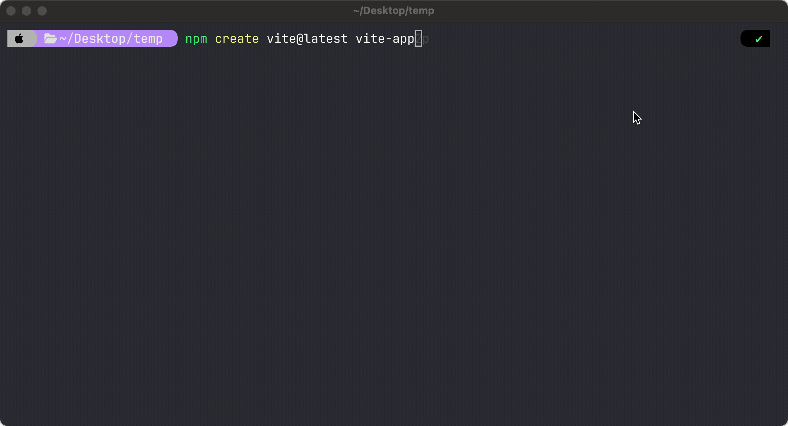

# ⚛️ React Development Tools Installation Guide

Welcome to the **React Development Tools Installation Guide**! 🚀 This guide will help you install and verify essential tools for React development, including **VS Code, Node.js, and Vite**.

---

## ✅ Required Tools

You'll need the following tools installed:

- [VS Code](https://code.visualstudio.com) - Code editor with great React support
- [Node.js (LTS Version)](https://nodejs.org/en) - JavaScript runtime for running React apps
- [Vite](https://vitejs.dev/) - Fast, modern build tool for React apps

Ensure you install the **LTS (Long-Term Support) version** of Node.js for stability. 🔄

---

## 🌍 Managing Node Versions with NVM

**NVM (Node Version Manager)** is the recommended way to install and manage multiple versions of Node.js but totally optional! You can install Node.js directly from [Node web-site](https://nodejs.org/en).

NVM ensures compatibility across different projects.

### 🖥️ Install NVM

### **macOS & Linux**

Run the following command:

```bash
curl -fsSL https://raw.githubusercontent.com/nvm-sh/nvm/v0.39.4/install.sh | bash
```

Restart your terminal, then verify NVM installation:

```bash
nvm --version
```

To install the **latest LTS version of Node.js**:

```bash
nvm install --lts
```

To switch between versions:

```bash
nvm use <version>
```

### **Windows**

For Windows, install **nvm-windows** from the [official GitHub page](https://github.com/coreybutler/nvm-windows/releases). Restart your terminal after installation.

---

## ⚠️ Test Node.js Installation

Create a text file called **`index.js`** with the following content:

```javascript
console.log("Hello, World!");
```

Run the script using Node.js:

```bash
node index.js
```

You should see this output:

```
Hello, World!
```

**Example in macOS Terminal:**


**Example in Windows (VS Code & Command Prompt):**


---

## ⚠️ Test React Installation

React apps used to be created with `create-react-app` (CRA). However, **CRA is now largely deprecated (as of 2025).** Instead, **Vite** is recommended for modern React projects.

**To create a new React app with Vite:**

```bash
npm create vite@latest vite-app
```

Choose React, JavaScript + SWC:



Then:

```bash
cd vite-app
npm install
npm run dev
```

This will start a local development server. Open your browser and visit:

```
http://localhost:5173/
```


If everything is set up correctly, you should see the Vite React template running! 🎉

---

## 🎯 Verifying Installations

Check your installations by running:

```bash
node -v       # Node.js version
npm -v        # NPM version
nvm --version # NVM version (if installed)
```

Each command should return a version number. ✅

---

## 🤝 Need Help?

If you run into issues, refer to official documentation or raise an issue in this repository. Happy coding! 💻✨
