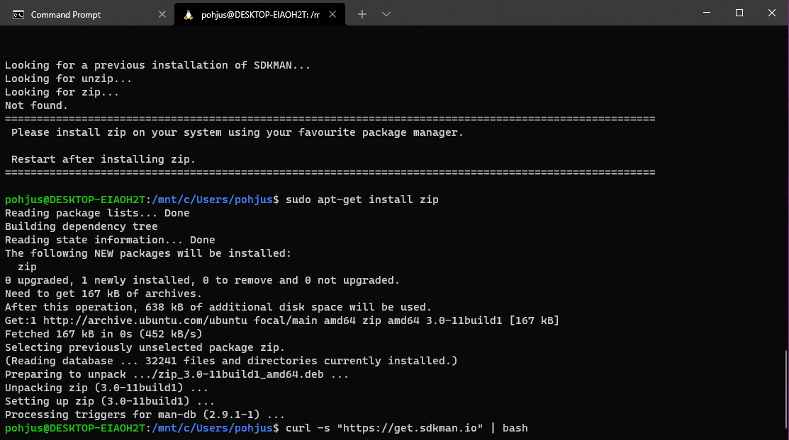

# Java Tools (Under Construction)

You will need

- [Java LTS version](https://adoptium.net/en-GB/)
- [Kotlin](https://kotlinlang.org/docs/command-line.html)
- [Gradle](https://gradle.org/install/)
- [Maven](https://maven.apache.org/download.cgi)

The preferred way of installing all of the tools is [SDKMAN!](https://sdkman.io). But this tool works only **on unix-based machines like macOS and Linux.** By using SDKMAN you can install and configure all of these using command line. You can also install multiple versions of these in the same computer.

Windows options are

- [Cygwin](https://www.cygwin.com)
- Windows Subsystem for Linux (install instructions below)
  - GUI exercises can be complicated in WSL2! 😞

## macOS installation for sdkman

Open terminal and give command:

    curl -s "https://get.sdkman.io" | bash

Reboot your terminal. Now install

- Java LTS (Temurin)
- Kotlin
- Gradle
- Maven

See commands how to install below ⬇️

## Windows 10+: Subsystem for Linux and sdkman

You can install [Windows subsystem for linux](https://www.windowscentral.com/install-windows-subsystem-linux-windows-10) and [Ubuntu from the Store](https://www.microsoft.com/en-us/p/ubuntu-2004/9n6svws3rx71?activetab=pivot:overviewtab). You can also install [new terminal](https://www.microsoft.com/en-us/p/windows-terminal/9n0dx20hk701?activetab=pivot:overviewtab) for windows.

Then you can open the new terminal and ubuntu:

Install zip and unzip apps:

    sudo apt-get install unzip zip

Then install sdkman by giving following command

    curl -s "https://get.sdkman.io" | bash

Reboot you terminal, so basically start ubuntu again.

# Java Installation

Type

    sdk list java

in terminal.

It should display:

Install Java Temurin [latest LTS version](https://www.oracle.com/java/technologies/java-se-support-roadmap.html).

To do this, give command:

    sdk install java 21.0.6-tem  // or similar!

Where 21… is the identifier (Version may vary). Java should be installed now, write

    java -version
    javac -version

To see that it works. You may need to reboot your terminal.

# Kotlin, Gradle and Maven Installation

By using SDKMAN it is really simple to install the latest versions of Kotlin, Gradle and Maven if needed:

    sdk install kotlin
    sdk install gradle
    sdk install maven
